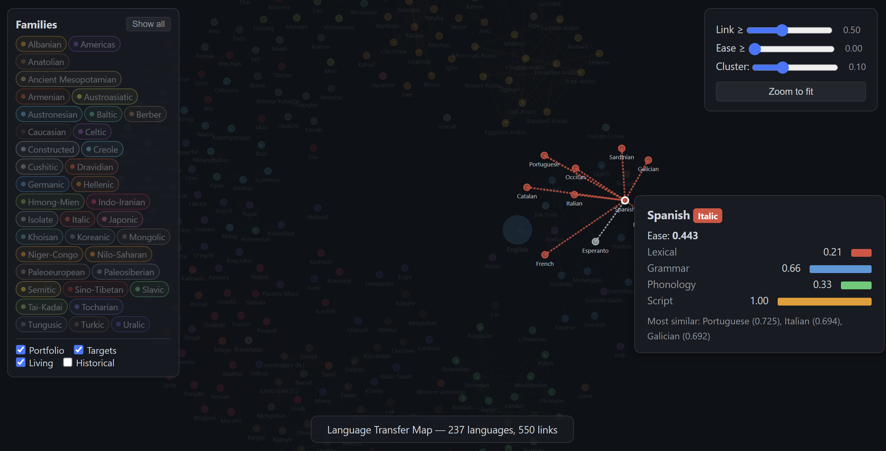

# Language Transfer Map

*Input your language portfolio. See what's within reach.*



A Streamlit web app that estimates how easy each of 283 languages would be to learn given your current language portfolio. Input your languages and self-assessed proficiency levels (0–5), and get a ranked ease report with an interactive force-directed graph showing cross-linguistic transfer across lexical, grammatical, phonological, and script dimensions.

[](https://your-app.streamlit.app)

## How it works

Each target language is scored across four dimensions, weighted and combined:

| Dimension | Weight | Source |
|-----------|--------|--------|
| Lexical | 45% | Cognate datasets (Lexibank/CLDF) + ASJP fallback + loanword scores |
| Grammar | 30% | WALS v2020.4 typological features |
| Phonology | 15% | PHOIBLE v2.0.1 phoneme inventories |
| Script | 10% | Manually curated script accessibility data |

Your proficiency in each known language modulates how much transfer you get from it. See [assets/methodology.md](assets/methodology.md) for full methodology and [assets/proficiency-levels.md](assets/proficiency-levels.md) for the level scale.

## Run locally

```bash
pip install -r requirements.txt
streamlit run app.py
```

## Command-line interface

```bash
python cli.py --portfolio "French:5,Spanish:3"              # ranked list to stdout
python cli.py --portfolio "French:5,Spanish:3" --top 10     # limit rows
python cli.py --portfolio "French:5,Spanish:3" --target Italian          # dimension breakdown
python cli.py --portfolio "French:5,Spanish:3" --report report.html      # save HTML report
python cli.py --portfolio "French:5,Spanish:3" --report report.md --graph  # report + graph
```